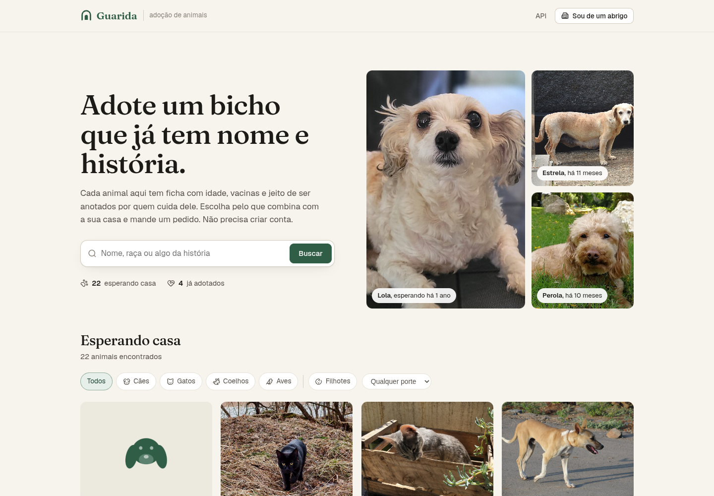
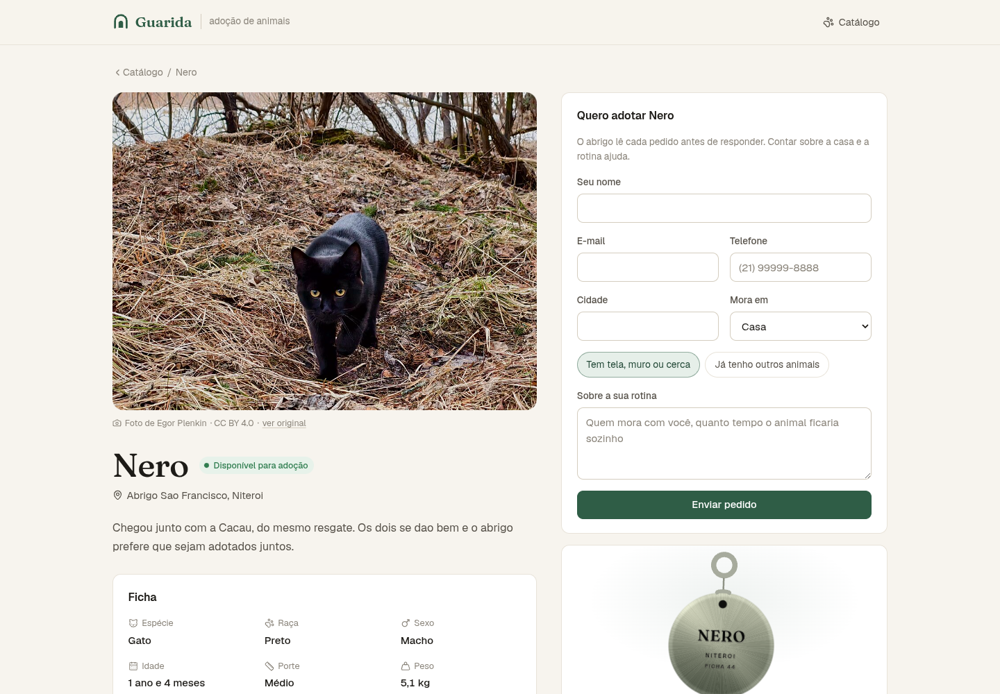
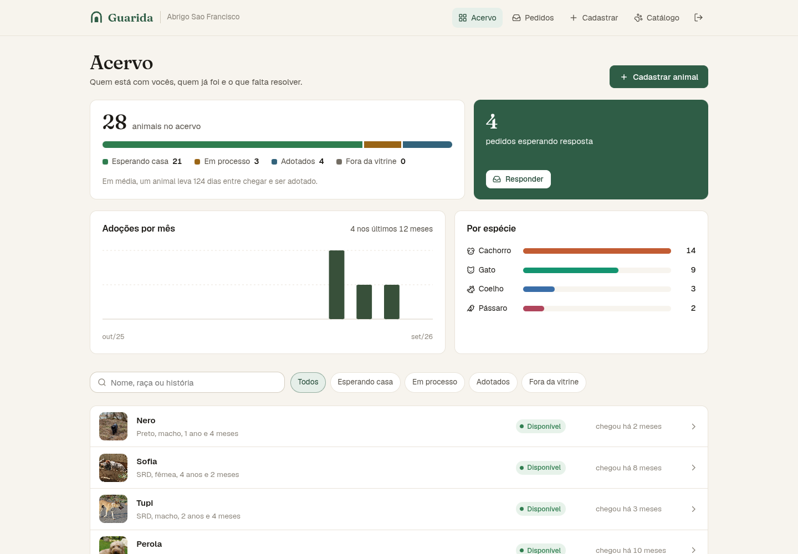
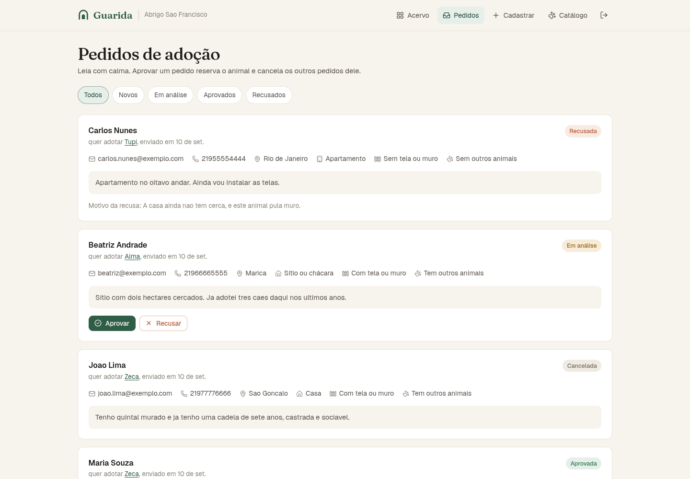
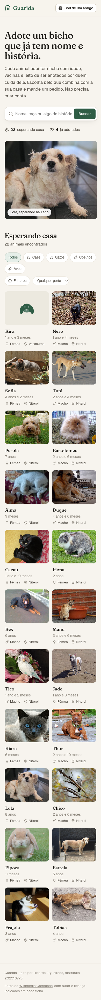
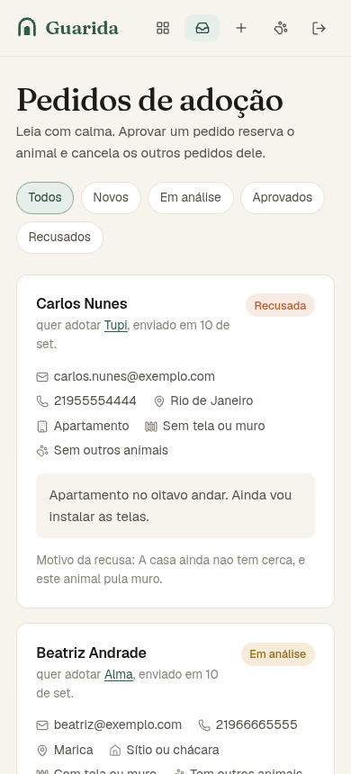

# Guarida

Sistema de cadastro e gerenciamento de animais para adoção. Tem duas caras: um
catálogo aberto, onde qualquer pessoa consulta os animais e manda um pedido de
adoção sem criar conta, e um painel do abrigo, onde só quem cuida cadastra,
altera e exclui.

**Autor:** Ricardo Figueiredo
**Matrícula:** 202310773
**Avaliação:** Prova prática de Desenvolvimento de Sistema Java

## As cinco operações do enunciado

| Operação | Método e rota | Precisa de token |
|---|---|---|
| Cadastro de um animal | `POST /api/v1/animais` | sim |
| Consulta dos animais | `GET /api/v1/animais` | não |
| Consulta de um animal pelo ID | `GET /api/v1/animais/{id}` | não |
| Alteração de um animal | `PUT /api/v1/animais/{id}` | sim |
| Exclusão de um animal | `DELETE /api/v1/animais/{id}` | sim |

Consultar é aberto de propósito: procurar um animal para adotar não pode exigir
cadastro. O que muda a vida de um bicho passa pelo abrigo dono, e por isso pede
token.

## Sistema no ar

```
Catálogo e painel: https://guarida-aula.malha.app
API e documentação: https://api-guarida-aula.malha.app/swagger-ui.html
```

Conta de demonstração, já povoada com 28 animais, 4 adoções concluídas, 3 em
processo e uma fila de pedidos:

```
e-mail: abrigo@guarida.app
senha:  demonstracao2026
```

A conta é pública para que a avaliação não dependa de cadastro. O que estiver lá
pode ser alterado por qualquer pessoa que abra o link. Para refazer o povoamento
do zero: `cd web && npm run semear`.

## Como rodar

O perfil padrão sobe com H2 em memória, então não é preciso instalar banco
nenhum:

```bash
./mvnw spring-boot:run
```

A API fica em `http://localhost:8080` e a documentação interativa em
`http://localhost:8080/swagger-ui.html`. Pelo Swagger dá para criar um abrigo,
pegar o token no botão Authorize e disparar as cinco operações sem Postman.

Para rodar contra PostgreSQL, use o perfil `prod` e informe as variáveis:

```bash
export SPRING_PROFILES_ACTIVE=prod
export GUARIDA_DB_URL=jdbc:postgresql://localhost:5432/guarida
export GUARIDA_DB_USUARIO=guarida
export GUARIDA_DB_SENHA=sua-senha
export GUARIDA_JWT_SEGREDO=uma-chave-com-pelo-menos-32-caracteres
./mvnw spring-boot:run
```

As tabelas são criadas pelo Flyway na subida, a partir de
`src/main/resources/db/migration`.

## Stack

- Java 21
- Spring Boot 3.5.16 (Web, Data JPA, Validation, Security)
- PostgreSQL 17 em produção, H2 em memória no perfil padrão e nos testes
- Flyway para versionamento do banco
- springdoc-openapi para a documentação interativa
- JJWT para emissão e validação dos tokens
- JUnit 5, AssertJ, Mockito e MockMvc nos testes
- Next.js 15 com React 19, TypeScript e Three.js no catálogo e no painel
- Ícones do Lucide, Fraunces nos títulos e Geist no texto
- Vitest e Testing Library nos testes da interface

O projeto foi desenvolvido no IntelliJ IDEA e abre direto como projeto Maven.

## Testes

```bash
./mvnw verify          # API: testes e conferência de cobertura
cd web && npm test     # interface
```

**API: 141 testes, todos passando.** Ficam em três níveis: as regras de domínio
em testes de unidade puros, o fluxo completo em testes de integração que sobem o
contexto do Spring e chamam a API por HTTP, e os caminhos de borda da
autenticação, do envio de foto e do tratamento de erro. O JaCoCo mede **99,5% de
instruções, 99,4% de ramos e 99,3% de linhas**, e `./mvnw verify` reprova se
instruções ou ramos caírem abaixo de 98%. O que sobra descoberto é o `main` da
aplicação e o `catch` de um algoritmo de hash que toda JVM é obrigada a ter.

**Interface: 158 testes, todos passando**, de `lib/` às páginas, com a API
simulada. A cobertura do V8 dá **100% de linhas e funções e 99,8% de ramos**, e
`npm run test:cobertura` reprova abaixo de 98%. A plaquinha de coleira fica fora
da conta: é WebGL, que o jsdom não tem, e a física dela mora em `lib/pendulo.ts`,
que tem teste próprio. Os testes esperam o que a pessoa vê e faz (rótulo, botão,
mensagem de erro), e não detalhe de implementação, para não quebrarem a cada
ajuste de layout.

Uma das classes de teste, `SemTransacaoDeTesteIT`, não leva `@Transactional`, e
a ausência é o ponto. Com a anotação, o Spring mantém uma sessão aberta durante
o teste inteiro e associação carregada sob demanda funciona mesmo quando não
deveria. Em produção a aplicação roda com `open-in-view` desligado: a transação
fecha no fim do service e qualquer proxy que sobreviva estoura na hora de montar
a resposta. Foi exatamente o que aconteceu com o abrigo dentro do animal, com a
suíte inteira passando e a listagem quebrando no servidor. Essa classe existe
para o erro não voltar.

## Regras de negócio

O animal tem situação, e as transições estão implementadas na própria entidade,
não no service, para que nenhuma camada consiga gravar um estado que o abrigo
não saberia justificar.

```
DISPONIVEL   -> EM_PROCESSO | INDISPONIVEL
EM_PROCESSO  -> ADOTADO | DISPONIVEL
ADOTADO      -> DISPONIVEL, apenas por devolução
INDISPONIVEL -> DISPONIVEL
```

Um pedido de adoção só entra para animal disponível. Aprovar um pedido reserva o
animal e cancela os outros pedidos em aberto para ele, senão duas pessoas
continuariam esperando pelo mesmo bicho e uma delas levaria uma recusa que
ninguém digitou. Recusar exige motivo escrito, porque recusa sem motivo não
ajuda quem recebeu.

Animal já adotado não pode ser excluído: o registro da adoção se perderia junto.
Nesse caso o caminho é registrar a devolução, que fica na linha do tempo e
devolve o animal ao catálogo.

## Endpoints

| Método | Rota | O que faz |
|---|---|---|
| POST | `/api/v1/autenticacao/registro` | Cadastra o abrigo |
| POST | `/api/v1/autenticacao/login` | Troca e-mail e senha por um token |
| GET | `/api/v1/autenticacao/eu` | Dados do abrigo dono do token |
| POST | `/api/v1/animais` | Cadastra um animal |
| GET | `/api/v1/animais` | Catálogo paginado, com filtros |
| GET | `/api/v1/animais/{id}` | Consulta um animal pelo id |
| PUT | `/api/v1/animais/{id}` | Altera um animal |
| DELETE | `/api/v1/animais/{id}` | Exclui um animal |
| GET | `/api/v1/animais/{id}/eventos` | Linha do tempo do animal |
| POST | `/api/v1/animais/{id}/eventos` | Registra vacina, castração, consulta |
| POST | `/api/v1/animais/{id}/suspensao` | Tira o animal da vitrine |
| POST | `/api/v1/animais/{id}/reativacao` | Devolve o animal à vitrine |
| POST | `/api/v1/animais/{id}/candidaturas` | Envia um pedido de adoção, sem cadastro |
| GET | `/api/v1/animais/{id}/candidaturas` | Pedidos de um animal |
| POST | `/api/v1/animais/{id}/devolucao` | Registra a devolução de um adotado |
| PUT | `/api/v1/animais/{id}/foto` | Envia ou troca a foto, com autor, licença e origem |
| GET | `/api/v1/animais/{id}/foto` | Baixa a foto, com cache e ETag, sem token |
| DELETE | `/api/v1/animais/{id}/foto` | Remove a foto |
| GET | `/api/v1/candidaturas` | Fila de pedidos do abrigo |
| POST | `/api/v1/candidaturas/{id}/analise` | Marca o pedido como em análise |
| POST | `/api/v1/candidaturas/{id}/aprovacao` | Aprova e reserva o animal |
| POST | `/api/v1/candidaturas/{id}/recusa` | Recusa, com motivo |
| POST | `/api/v1/candidaturas/{id}/adocao` | Conclui a adoção |
| GET | `/api/v1/painel/animais` | Acervo do abrigo, inclusive fora da vitrine |
| GET | `/api/v1/painel/resumo` | Contagem por situação e tempo médio até adotar |
| GET | `/api/v1/painel/especies` | Quantos animais de cada espécie |
| GET | `/api/v1/painel/adocoes-por-mes` | Adoções concluídas a cada mês |
| GET | `/saude` | Verificação de disponibilidade |

O catálogo aceita filtro por espécie, porte, sexo, situação, temperamento,
cidade do abrigo, apenas filhotes e busca livre por nome, raça ou história. A
busca e a cidade ignoram acento nos dois sentidos: "perola" acha Pérola e "SAO
GONCALO" acha São Gonçalo. Os
filtros são montados como `Specification`, e não como uma derived query por
combinação, que dobraria a cada filtro novo.

## Erros

Todo erro sai no formato RFC 7807, com `title`, `status` e `detail`. Erro de
validação traz também o objeto `campos`, com a mensagem de cada campo reprovado:

```json
{
  "title": "Requisição inválida",
  "status": 400,
  "detail": "Um ou mais campos não passaram na validação.",
  "campos": { "nome": "todo animal precisa de um nome, nem que seja provisório" }
}
```

Os códigos usados são 400 para entrada malformada, 401 sem token válido, 404
para animal inexistente ou de outro abrigo, 409 para e-mail já cadastrado, 413 para
foto acima do limite e 422 para operação proibida pela regra de negócio.

## Catálogo e painel

O repositório traz também a interface em Next.js que consome esta API, na pasta
`web/`. Ela tem identidade própria, chamada Guarida, documentada em
`web/MARCA.md`: nome, símbolo, paleta, tipografia, regras de movimento e voz.

A peça tridimensional é a plaquinha de coleira, que é o objeto que marca que um
animal deixou de ser de ninguém e passou a ser de alguém. Ela pendura de uma
argola e balança com física de pêndulo de verdade, com a aceleração angular
proporcional ao seno do ângulo e atrito, e não com uma mola linear, que daria um
vaivém de metrônomo. Também gira no próprio eixo, o que deixa ver o verso
gravado. Na ficha de cada animal ela sai gravada com o nome dele e o número da
ficha.

Os 28 animais da conta de demonstração têm foto de verdade, escolhida uma a uma
no Wikimedia Commons para bater com a espécie, a raça e a história de cada um, e
só entre imagens de licença livre (CC0, domínio público, CC BY e CC BY-SA). Como
CC BY e CC BY-SA só permitem o uso com atribuição, cada foto sobe junto com
autor, licença e link da página de origem, e a ficha mostra esse crédito embaixo
da imagem. A lista está em `web/scripts/fotos.json`.

A foto mora em tabela própria, e não em coluna do animal, para a listagem do
catálogo não arrastar os bytes de dezenas de imagens a cada página. O formato é
conferido pelos primeiros bytes do arquivo (JPEG, PNG ou WEBP), porque o tipo
declarado no envio é escolha de quem envia e não prova nada. A URL leva a versão
do conteúdo, então o navegador guarda a imagem por uma semana e ainda assim vê a
troca na hora. O link de origem só é aceito começando por `http://` ou
`https://`, já que ele vira link clicável na ficha pública.

Quando um animal ainda não tem foto, ou a imagem falha ao carregar, entra um
retrato geométrico da espécie sobre um matiz derivado do id: desenho assumido,
que não finge ser fotografia.

Os gráficos do painel são desenhados em SVG, sem biblioteca. A paleta passou em
verificação automática de banda de luminosidade, piso de croma, separação sob
daltonismo protan, deutan e tritan, e contraste contra o papel. A cor segue a
espécie e nunca a posição no ranking, então filtrar a lista não repinta o que
sobrou.

```bash
cd web
npm install
npm run dev     # catálogo e painel em localhost:3000, com a API em localhost:8080
npm run prints  # percorre as telas em Chromium headless e grava as imagens
```

Telas em `web/prints/`, gravadas contra a API de verdade. O mesmo script falha
se aparecer erro no console do navegador.









<p>
  
  
</p>

## Organização do código

```
src/main/java/br/com/ricardofigueiredo/guarida
├── abrigo       cadastro e login de quem mantém os animais
├── animal       entidade raiz, linha do tempo, filtros, service e controller
├── candidatura  pedidos de adoção e o que o abrigo faz com eles
├── comum        tratamento de erro, paginação e verificação de disponibilidade
├── config       segurança, OpenAPI e o relógio injetável
├── foto         envio, conferência e entrega da foto com crédito
├── painel       contagens e séries que o abrigo vê ao entrar
└── seguranca    emissão do token, filtro de autenticação e resposta de 401
```

## Onde está rodando

A aplicação está publicada em um container LXC dentro de um Proxmox VE. Dentro
do container há três processos: o PostgreSQL, a API empacotada como jar na porta
8081 e a interface Next.js na porta 3000, os dois últimos sob systemd com
reinício automático nas unidades `guarida.service` e `guarida-web.service`. Um
nginx na frente serve a interface em `/` e encaminha `/api`, `/saude` e a
documentação para a API, de modo que os dois compartilham a mesma origem e não
existe CORS no caminho.

As credenciais de banco e o segredo do JWT ficam fora do repositório, em um
arquivo de ambiente lido pelas unidades do systemd. O nginx limita o corpo das
requisições a 1 MB, com exceção da rota de foto, que aceita até 3 MB.
